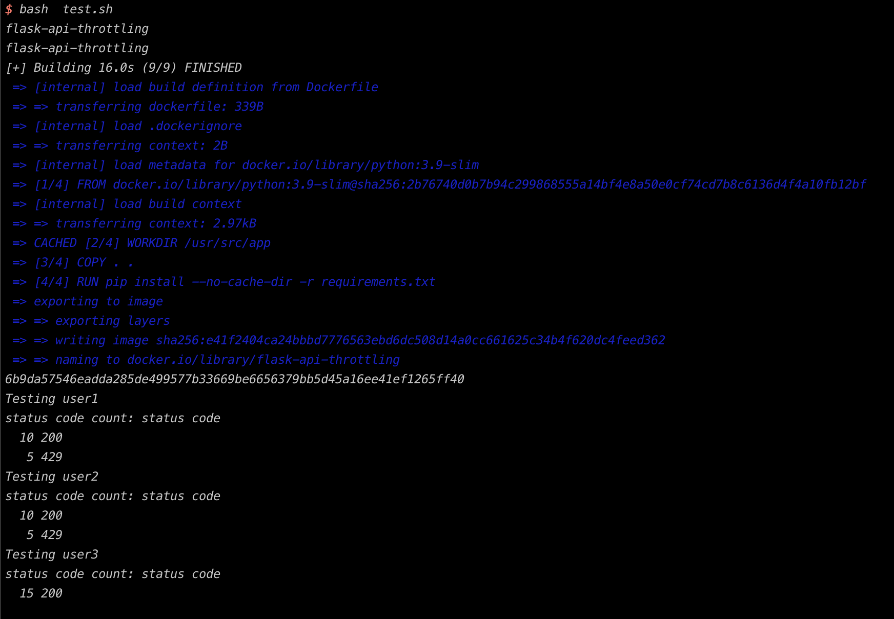

# Flask API Rate Limiting POC

This project contains a simple Flask API that has per-user request rate limiting. It's designed to allow only a certain number of requests per second for each user to ensure fair resource usage and prevent overloading the server.

## Overview

The Flask API has three users configured:

user1: Allowed 10 requests per second.
user2: Allowed 10 requests per second.
user3: No rate limiting.

## Testing Script

Here's what each part of the script does:

- Build and Run the Container
- Send Requests: It uses these status codes to determine whether the requests are successful or if they're being rate-limited (HTTP 429 status code).
- Status Code Counting for three user

How to Run the test

```
bash test.sh
```

The script will handle the rest, from building the Docker image to testing the rate limits. You'll see the output directly in your terminal window.

## Result


